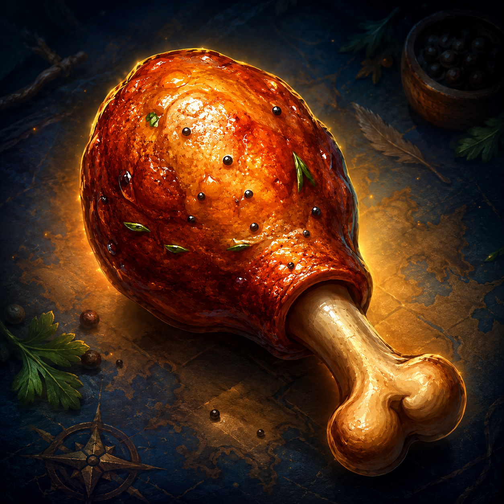

# AutoFeed

**One button to eat, drink, pot, and buff.** AutoFeed keeps a small set of self-updating macros pointed at the best consumables in your bags, so you never have to drag food, water, potions, or scrolls onto your action bars again. Built for **WoW Classic Era / Hardcore (1.15.x)**.

When a stack runs out, you level up, or you loot something better, the macros rewrite themselves. You place each button once and forget it.

## Features

- **Food & water** — picks the best item for your level (conjured first, optional), drains partial stacks, and can eat + drink on a single click.
- **Healing & mana potions** — combat-safe macros that list your top 3 tiers, so if your best potion runs out mid-fight the next one fires (they share the cooldown, so only one is used). Choose **strongest-first** or **weakest-first** (drain the small ones, save the big).
- **Scroll buffs** — cycles through your Scrolls of Stamina / Strength / Agility / Intellect / Spirit / Protection, showing the next buff you're missing and going blank once you're fully buffed. Always self-targeted, so you never buff a passerby.
- **Bandages** — a macro pointed at your best bandage (with the next tier as a fallback). Bandages are off-cooldown healing — a hardcore staple.
- **Minimap button** — left-click for settings, right-click to create macros, drag to reposition (toggle in Settings).
- **Exclude list** — a checklist of the potions and scrolls in your bags; uncheck any and the macros will never touch it (remembered by item).
- **Buff-food filter** — ignores Well Fed / stat food by default so you save it for raids.
- **Self-updating** — reacts to bag changes, level-ups, and buff changes; updates are deferred during combat (you're not eating mid-fight anyway).

## The macros

AutoFeed can manage up to six per-character macros. They are **not** created automatically — each one costs a character macro slot, so you create only the ones you want: a welcome window pops on first login (reopen with `/autofeed welcome`), and **Settings** has the same **Create** buttons. Once created, drag them from **Esc → Macros** onto your action bars (one time):

| Macro | Does |
|---|---|
| `AutoFeed` | eat the best food |
| `AutoDrink` | drink the best water |
| `AutoHealPot` | use the best healing potion (combat-safe) |
| `AutoManaPot` | use the best mana potion (combat-safe) |
| `AutoScroll` | use the next scroll buff you're missing |
| `AutoBandage` | use your best bandage |

## Installation

1. Download and unzip into `World of Warcraft/_classic_era_/Interface/AddOns/`.
2. Make sure the folder is named `AutoFeed` and contains the `.toc`.
3. `/reload` or restart the game. A welcome window lets you create the macros you want (or use `/autofeed`), then drag them from Esc → Macros onto your bars.

## Slash commands

- `/autofeed` (or `/af`) — open settings
- `/autofeed welcome` — reopen the welcome window (create macros)
- `/autofeed status` — show what each macro currently points at
- `/autofeed update` — force a refresh
- `/autofeed debug` — list the consumables AutoFeed sees in your bags

## Settings (`/autofeed`)

Toggle each macro on/off, prioritize conjured items, filter buff food, combine eat+drink into one button, choose potion order (strongest/weakest first), exclude specific potions and scrolls, and enable/disable the scroll cycler.

## Notes

- Item detection (food vs. potion, scroll buffs) is tuned for an **English (enUS)** client. Other locales may need pattern adjustments — open an issue.
- Each managed macro uses one per-character macro slot (max 18). Disable any you don't use.

## License

MIT — see [LICENSE](LICENSE).
