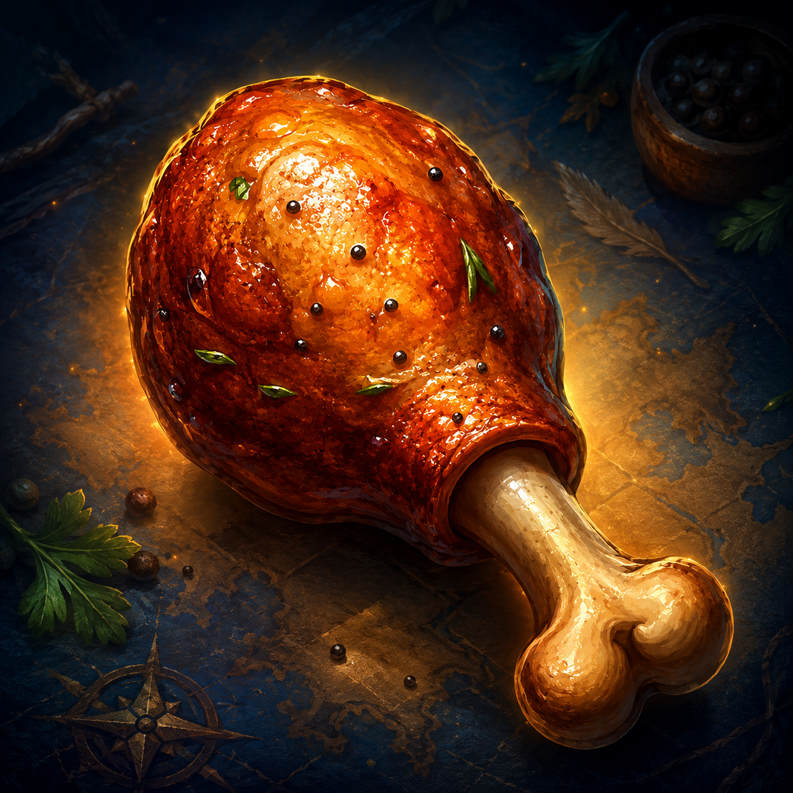

# AutoFeed

**One button to eat, drink, pot, and buff.** AutoFeed keeps a small set of self-updating macros pointed at the best consumables in your bags, so you never have to drag food, water, potions, or scrolls onto your action bars again. Built for **WoW: Forever**.

When a stack runs out, you level up, or you loot something better, the macros rewrite themselves. You place each button once and forget it.

## Features

- **Food & water** — picks the best item for your level (conjured first, optional), drains partial stacks, and can eat + drink on a single click.
- **Well Fed XP** — on Forever, Well Fed also gives +5% experience from kills. While you're leveling without the buff, the food macro eats buff food until it's up, then goes back to plain food (optional).
- **Buff-food filter** — otherwise ignores Well Fed / stat food, so you save it for raids and dungeons.
- **Healing & mana potions** — combat-safe macros that list your top 3 tiers, so if your best potion runs out mid-fight the next one fires (they share the cooldown, so only one is used). Choose **strongest-first** or **weakest-first** (drain the small ones, save the big).
- **Scroll buffs** — cycles through your Scrolls of Stamina / Strength / Agility / Intellect / Spirit / Protection, showing the next buff you're missing and going blank once you're fully buffed. Always self-targeted, so you never buff a passerby.
- **Bandages** — a macro pointed at your best bandage (with the next tier as a fallback).
- **Exclude list** — a checklist of the potions and scrolls in your bags; uncheck any and the macros never touch it (remembered by item).
- **Self-updating** — reacts to bag changes, level-ups, and buff changes; updates made during combat wait until the fight ends.

## The macros

AutoFeed can manage up to six per-character macros. They are **not** created automatically: each one costs a character macro slot, so you create only the ones you want. On a character with no AutoFeed macros yet, the welcome window opens once after login with a **Create** button for each; the settings page has the same buttons. Then drag them from **Esc → Macros** onto your action bars (one time):

| Macro | Does |
|---|---|
| `AutoFeed` | eat the best food |
| `AutoDrink` | drink the best water |
| `AutoHealPot` | use the best healing potion (combat-safe) |
| `AutoManaPot` | use the best mana potion (combat-safe) |
| `AutoScroll` | use the next scroll buff you're missing |
| `AutoBandage` | use your best bandage |

## Getting around

- **The AutoFeed icon on the minimap** (behind the YippYapp button if you use several YippYapp addons): left-click opens the page with the Create buttons, right-click opens the settings. The same clicks work in the addon compartment.
- `/autofeed` (or `/af`) — open the settings
- `/autofeed welcome` — open the page with the Create buttons
- `/autofeed status` — show what each macro currently points at, and whether you're Well Fed
- `/autofeed update` — rescan your bags and rewrite the macros now

## Settings

In **Options → AddOns → YippYapp → AutoFeed**: turn each macro on or off, save or eat buff food, put conjured items first, combine eat + drink into one button, choose the potion order, and exclude specific potions and scrolls.

## Part of YippYapp

AutoFeed works fully on its own. It is also part of **YippYapp**, a family of addons for WoW: Forever that work even better together:

- **BuffWarden** shows the class buffs you and your group are missing. Together they cover your buffs: BuffWarden the class buffs, AutoFeed the food and scroll buffs from your bags.
- **Guildhall** is your guild's crafting directory: see which guildie can cook the buff food or brew the potions your macros use.
- **Skillwright** plans the cheapest route to max profession skill, from the game's own recipe data.
- **Campfire** shows which guildies are nearby: how far away, in which direction, and a one-click whisper.

Installed together, they share one minimap button, one welcome window (`/yippyapp`), and one settings page for the shared bits (Options → AddOns → YippYapp).

## Installation

1. Download and unzip into the Forever client's `Interface/AddOns/` folder.
2. Make sure the folder is named `AutoFeed` and contains the `.toc`.
3. Restart the game. On a character without AutoFeed macros, the welcome window opens so you can create the ones you want.

## Notes

- Item detection (food vs. potion, scroll buffs) is tuned for an **English (enUS)** client. Other locales may need pattern adjustments — open an issue.
- Each managed macro uses one per-character macro slot. Turn off the ones you don't use.
- The Classic Era version of AutoFeed lives in its own repository: https://github.com/vBaustad/AutoFeed-Classic

## License

MIT — see [LICENSE](LICENSE).
